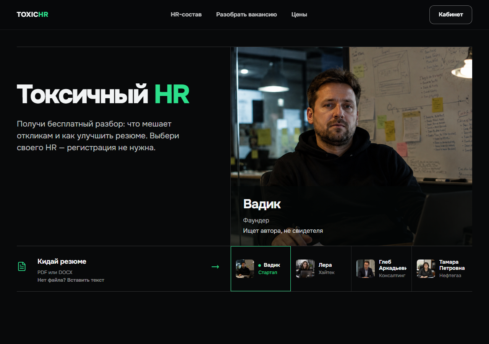
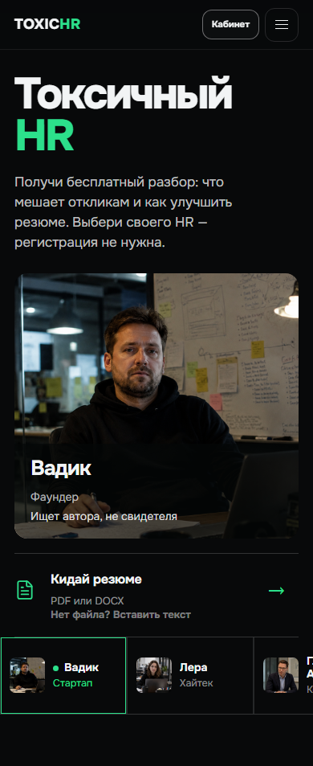
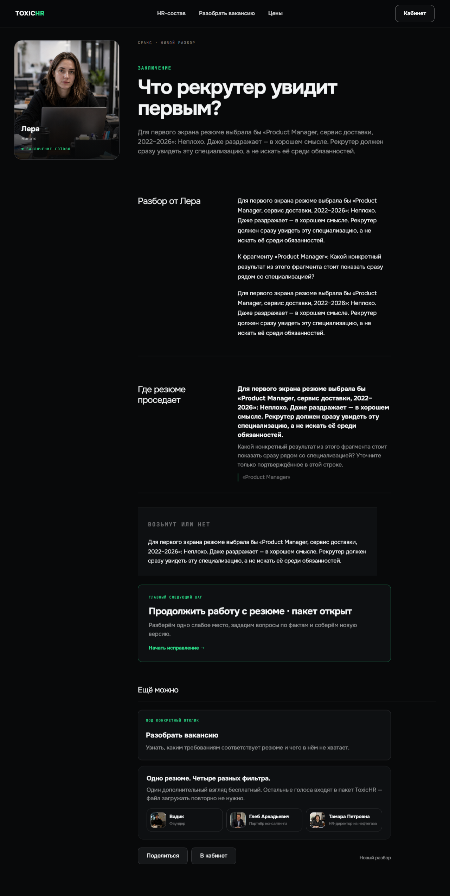
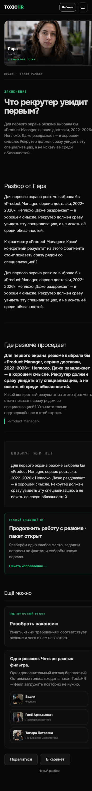
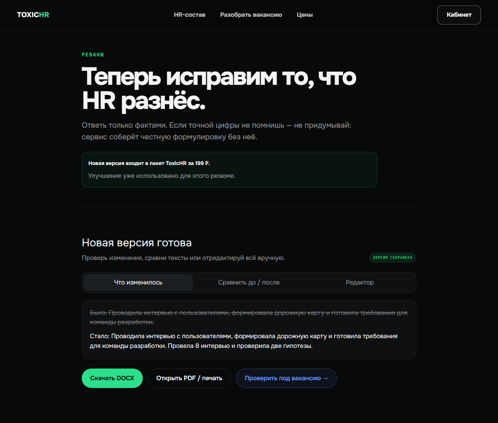
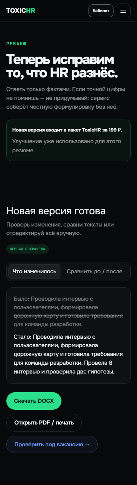
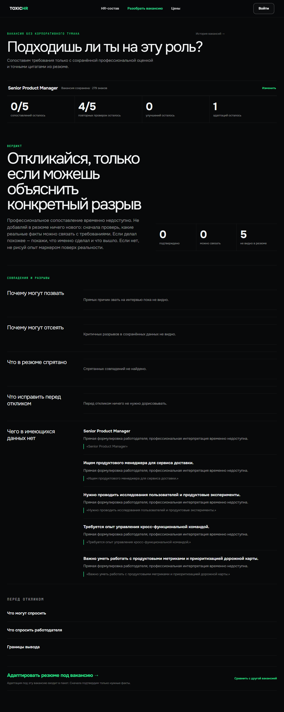
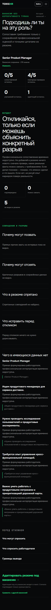

# Исправления по аудиту · 15.09.2026

База: `4afb097`. Изменения локальные, без коммита, push и облачного CI. Это адресные исправления, не приёмка релиза.

## Исправлено

- Sync/SSE запуск и переиспользование анализа проверяют владельца резюме до выдачи результата и вызова AI.
- Загрузка текста/файла сохраняет владельца; новый анализ получает владельца и попадает в историю аккаунта.
- Изменённый текст вакансии создаёт отдельную запись даже при переданном старом ID. Кнопка другой вакансии очищает текст, ID, результат и URL.
- Кнопка из улучшения сначала сохраняет правки и получает анализ конкретной улучшенной версии. Повтор использует сохранённый анализ этой версии. Ручное редактирование создаёт новую версию, сохраняя старые результаты.
- Платный CTA перенесён после бесплатного разбора и учитывает купленный пакет. В ошибке третьего HR появился переход к пакету.
- Главная объясняет пользу и бесплатный старт; сетка перестраивается до планшетного переполнения. Повышен контраст faint-текста. Остатки улучшения/адаптации отображаются числами без наложения. Убраны две непонятные формулировки, включая wishlist.

## Проверки

- `npm run lint`: 0 ошибок, 1 предупреждение о window.location.assign во внутреннем переходе из улучшения.
- `npm run typecheck`: успешно. Production build успешен; использован для адресного браузерного теста.
- Monetization: существующий сценарий серверного paywall/лимитов и новая регрессия аудита — 2/2, mock AI, 22 секунды вместе с сервером.
- Регрессия проверяет два аккаунта, запрет чужого sync/SSE анализа, запрет выдачи чужого кэшированного анализа, владельца записи, сохранность вакансии, точную улучшенную версию, повтор без нового анализа и отдельную версию после правки.
- После обнаруженного на скриншоте наложения подписей исправлены только подписи; отдельная визуальная проверка desktop/mobile успешна, без повторного AI/monetization набора. Её утверждения включены в основную регрессию.
- Снимки главной: 1280 / 834 / 390 px; результата, улучшения и вакансии: desktop/mobile. `tests/artifacts/audit/`.
- Live AI, реальные платежи и `suite=full` не запускались по ограничению пользователя. Исторический CI не засчитывается.

## Ещё не закрыто

- Восстановление забытого пароля, контакт поддержки, условия покупки/возврата и согласие до загрузки резюме.
- Независимая оценка полезности платного AI-результата на реальных резюме.
- Production-платёж, выдача доступа, backup restore и smoke после деплоя: прежние блокеры сохраняются.
- Это не полный аудит авторизации всех API и не миграция исторических записей без владельца.

## Скриншоты

